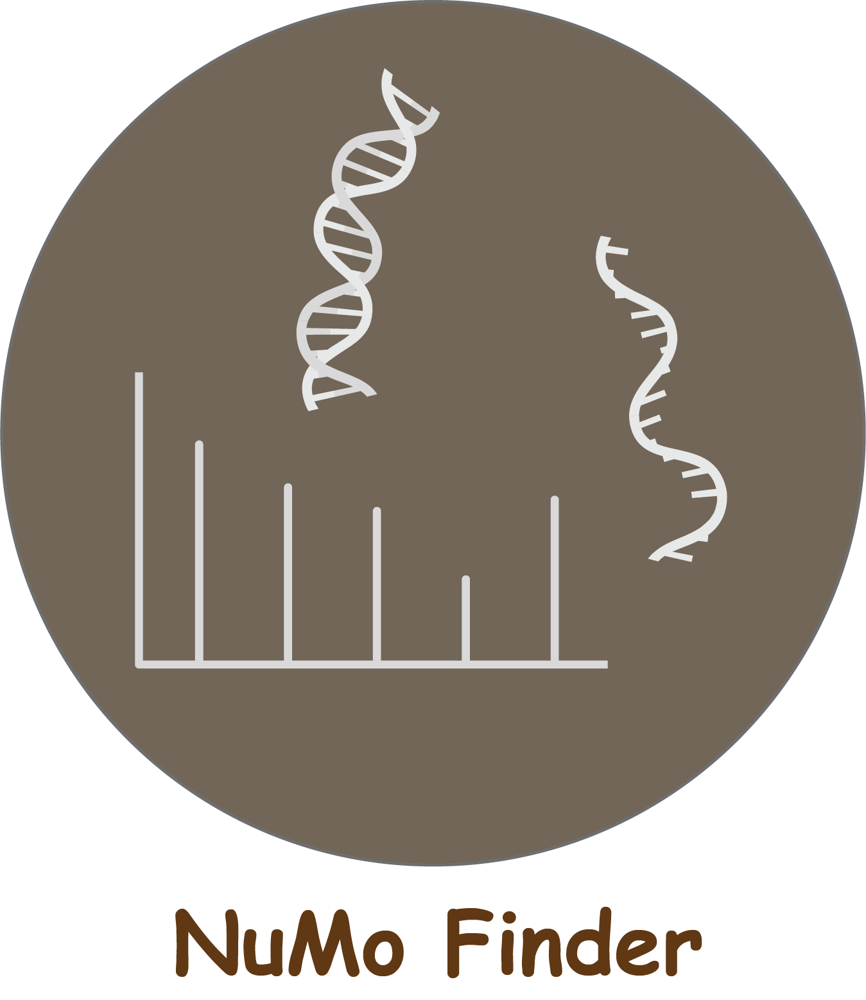

# NuMoFinder

<p align="center">
    <br>
</p>

## Overview

Monitoring nucleoside modifications are critical to the general area of epigenetic and epitranscriptomic research, as a large majority of DNAs and RNAs are modified. NuMoFinder is an open-source software tool developed using Python and the MatchMS library. It's designed to automatically identify and quantify the peaks of nucleic acid modifications referred from Modomics and DNAmod databases across a series of mass spectrometry files. Meanwhile, NuMoFinder incorporates the unknown modification (untargeted) search relying on the major ribose/deoxyribose lost product ions of nucleosides generated from collision-induced dissociation (CID). This tool can be installed on all kinds of platforms (e.g., Linux, macOS, Windows, etc).

## Requirements

- Recommended OS: macOS (>= 10.13), Linux (e.g. Ubuntu >= 18.04), or Windows (>= 10)
- Python3 (3.7 or higher is supported)
- Pip3
- Python dependencies: numpy, scipy, matchms, pyyaml
- Conda (optional): Miniconda or Anaconda

## Installation Guide

In order to use NuMoFinder, you can install the dependent libraries either via package manager (Pip3) or by creating a new virtual environment with Conda

### Install via package

```
pip3 install scipy numpy matchms[chemistry] pyyaml
```

### Install via Conda

```
conda create --name matchms python=3.8
conda activate matchms
conda install --channel bioconda --channel conda-forge matchms
```

## Usage Example
1. Download the source code of NuMoFinder. You can manully download the zip file and unzip it, or you can use the following command to directly download it.
```
git clone https://github.com/ChenfengZhao/NuMoFinder.git
```
The github repository is composed of the following parts:
- **NuMoFinder.py** & **extract_dataset_info.py**  contain the python code of NuMoFinder.
- **config.ini** is to configure the internal parameters of the tool.
- **CustomizedMods.csv** (optional) provides the searching of user-defined databases if needed.

Here are the explaination on the parameters in config.ini:
- **input_path**: folder contains MS data files (.mzXML)
- **output_path**: folder to save the NuMo Finder search results (.mzXML) 
- **customized_mods_list**: the (optional) user-defined library that is included for searching 
- **nucleoside_type**: the type of analytes, DNA or RNA
- **permethyl**: if permethylation is used for preparing the analytes
- **polarity**: instrument polarity in MS analysis 
- **ms1_mass_error_ppm**: mass tolerance for MS1 searching 
- **ms2_mass_error_ppm**: mass tolerance for MS2 searching 
- **min_rel_height**: (optional) relative intensity threshold for searching 
- **min_height**: (optional) absolute intensity threshold for searching 
- **min_mass**: (optional) minimum m/z that is considered for searching 
- **max_mass**: (optional) maximum m/z that is considered for searching 
- **gaussian_filter**: (optional) Gaussian distribution is used for peak filtering 
- **align_tolerance_min**: the time tolerance for MS1 and MS2 peak alignment 
- **unknown_search_mode**: enable searching for unknown modifications 
- **min_height_unknow_search**: the MS2 intensity threshold in the unknown search 
- **flex_mode**: (optional) ignoring of the requirements for monoisotopic distribution of analytes

  
1. Prepare your MS files following the format of the example. Put these files under the path defined in the **input_path** of config.ini. NuMoFinder automatically searches and processes all the MS files in right format in batches. Feel free to skip this step if you are just intented to process the example data.

2. Execute NuMoFinder using the following code:

If the dependencies are installed via package manager
```
cd <the path of NuMoFinder.py>
python3 NuMoFinder.py
```

If the dependencies are installed by Conda
```
conda activate matchms
cd <the path of NuMoFinder.py>
python3 NuMoFinder.py
```

4. The results will be generated under the path defined in the **output_path** of config.ini (e.g., ./result/ in this example). It contains the individual results of each compound for each MS data file (i.e., NuMo_Result_XXX.csv), combined results of all the compounds in each MS data file (i.e., NuMo_Results_XXX.csv), and the results of unknow search mode (i.e., Unknown_Search_Result.csv) if enabled.


## License
[Apache_2.0_license]: http://www.apache.org/licenses/LICENSE-2.0

The source code of this project is released under the [Apache 2.0 License][Apache_2.0_license].

## Citation
If you think NuMoFinder is helpful for your research, please cite the following paper:

Xie, Y., Vitorino, F.N.D.L., Chen, Y., Lempiäinen, J.K., Zhao, C., Steinbock, R.T., Liu, X., Lin, Z., Zahn, E., Garcia, A.L. and Weitzman, M.D., (2023). SWAMNA: a comprehensive platform for analysis of nucleic acid modifications. Chemical Communications, https://doi.org/10.1039/D3CC04402E

[ChemComm version](https://pubs.rsc.org/en/content/articlelanding/2023/CC/D3CC04402E)

[ChemRxiv version](https://chemrxiv.org/engage/chemrxiv/article-details/64f6a89079853bbd781e9eb7)
